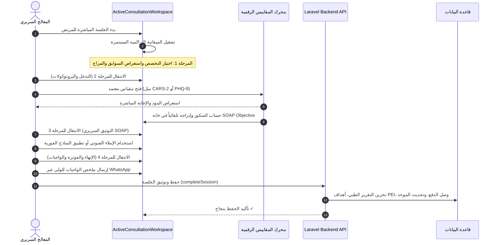
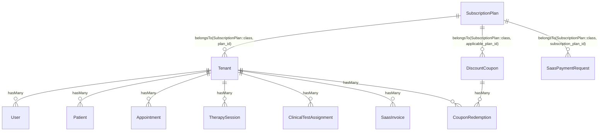

# 🏛️ Architecture Overview — المنصة الطبية الإكلينيكية المتكاملة (PsyPro / ClinicSaaS)

> **وثيقة المعمارية التقنية والتصميم الإكلينيكي الشامل**  
> نظام متعدد المستأجرين (Multi-Tenancy) لإدارة عيادات ومراكز علم النفس، الأرطوفونيا والتخاطب، والتأهيل النفسي-حركي.

---

## 1. المعمارية التقنية العامة (High-Level System Topology)

```
                            [ 🌐 Internet / Web & Mobile Clients ]
                                              │
                                              ▼
                              [ 🛡️ Nginx / Traefik Reverse Proxy ]
                            (SSL Termination, Custom Domain Routing)
                                              │
                     ┌────────────────────────┴────────────────────────┐
                     ▼                                                 ▼
        [ 🖥️ Frontend Client App ]                         [ ⚙️ Backend API Engine ]
           React 18 + Vite (PWA)                               Laravel 11 / PHP 8.2+
      (TailwindCSS, Lucide, Web Audio,                    (RESTful APIs, Multi-Tenant Guard,
        Web Speech API, RTL Arabic)                         Sanctum Auth, Queue Worker)
                     │                                                 │
                     │ (Direct In-Session Testing)                     │
                     └────────────────────────┬────────────────────────┘
                                              ▼
                             [ 🗄️ Database & Storage Layer ]
                                 MySQL / MariaDB Engine
                               (Tenants, Users, Patients,
                            Clinical Tests, Norms, Sessions)
```

---

## 2. المكونات المعمارية الأساسية (Core Architectural Components)

### 2.1. الواجهة الأمامية (Frontend Layer): `frontend/`
- **التقنيات المستخدمة**: React 18، Vite، Tailwind CSS، Lucide Icons، Web Audio API، Web Speech API.
- **الهوية البصرية ودعم اللغات**:
  - دعم كامل للغة العربية (RTL) مع خطوط طبية مقروءة وواضحة (Alexandria / Cairo / Inter).
  - وضع التركيز الإكلينيكي الداكن الهادئ (Clinical Dark Zen Mode) مع بطاقات زجاجية ناعمة (`backdrop-blur-md`).
- **الموديولات الرئيسية في الواجهة**:
  1. **قمرة الجلسة السريرية المباشرة (Active Consultation Workspace)**: مسار سريري مرحلي متسلسل من 4 خطوات (الاستقبال والمزاج، التدخل والبروتوكولات السريرية، التوثيق SOAP مع الإملاء الصوتي، والإنهاء والإحالات والفوترة).
  2. **محرك المقاييس والاختبارات الرقمية (Digital Testing Engine)**: بنك أسئلة معياري يضم 18 رائزاً معتمداً مع نافذة التمرير المباشر (`InteractiveTestPassationModal`) وبوابة المريض الذاتية (`PatientTestPortalView`).
  3. **أداة بناء المقاييس البصرية للسوبر أدمن (Super Admin Builder Tab)**: إدارة وتحرير بنود الأسئلة، الخيارات والأوزان، قواعد حساب الشدة والدرجات (Norms & Severity Rules)، وتنبيهات الأمان السريري الفورية (Red Alert Flags).
  4. **إدارة المرضى والسجلات الطبية (EHR Management)**: ملفات المرضى، السوابق النمائية (Anamnèse)، سجلات الجلسات التاريخية، والمواعيد.

### 2.2. الواجهة الخلفية ومنطق الأعمال (Backend API Layer): `backend/`
- **التقنيات المستخدمة**: Laravel 11، PHP 8.2+، MySQL / MariaDB، Laravel Sanctum.
- **المعالجات والخدمات الرئيسية (Key Controllers & Services)**:
  - `ClinicalTestAssignmentController.php`: إدارة التكليفات الرقمية للمقاييس، توليد الروابط ورموز الوصول السريع (Access Tokens)، استقبال الإجابات الذاتية، وحساب التنبيهات الحمراء (Red Alerts).
  - `SuperAdminController.php`: إدارة كتالوج المقاييس العالمية وتخزين مصفوفات الأسئلة وقواعد حساب الدرجات في عمود `norms_payload` بصيغة JSON.
  - `AppointmentController.php` & `SessionController.php`: توثيق الجلسات السريرية، الملاحظات المنهجية (SOAP Notes)، التكليفات المنزلية، واحتساب رسوم الجلسات وإصدار وصولات القبض.
  - `PatientController.php`: الملف الطبي الإلكتروني الشامل، إدارة السوابق، ومتابعة الخطط الفردية (PEI).
- **أمان وتعدد المستأجرين (Multi-Tenancy & Isolation)**:
  - عزل بيانات المرضى والجلسات على مستوى العيادة (`clinic_id` / `tenant_id`).
  - مصادقة محمية بـ Tokens مشفرة، مع روابط آمنة أحادية الاستخدام لبوابة المريض الذاتية بدون حاجة لتسجيل الدخول.

---

## 3. تدفق البيانات وسير العمليات (Data Flow & Life Cycles)

### 3.1. دورة حياة الجلسة السريرية المباشرة (Direct Clinical Session Flow):


### 3.2. دورة حياة المقاييس وبوابة الاختبار الرقمية (Digital Scale Passation):
1. **التعريف والتهيئة**: يقوم السوبر أدمن بتعريف أو تعديل المقياس (الأسئلة، الأوزان، فئات الشدة، وتنبيهات الخطر) عبر واجهة `AssessmentsCatalogManagerTab`.
2. **التكليف أو التمرير المباشر**:
   - *الخيار أ (تمرير مباشر)*: يفتحه المعالج داخل الجلسة عبر `InteractiveTestPassationModal`، وتُحقن النتيجة في تقرير الجلسة فوراً.
   - *الخيار ب (إرسال خارجي / تابلت)*: يُولد النظام رمز `access_token` فريد ويُنشئ رابطاً وبوابة رقمية خاصة بالمريض عبر `SendTestAssignmentModal`.
3. **الإجابة والتصحيح الآلي**: يقوم المريض بملء الاستبيان على هاتفه أو التابلت عبر `PatientTestPortalView`. عند الإرسال، يتحقق السيرفر من بنود الخطر (مثل بند الانتحار في BDI-II/PHQ-9)، ويقوم بوسم السجل بـ **`🚨 [تنبيه أمان سريري عاجل - RED ALERT]`** في سجل المريض.

### 3.3. قمرة الأجندة والمواعيد السريرية المتقدمة (Clinical Agenda & Cockpit):
1. **زوايا الرؤية الزمنية الـ 4**:
   - `جدول الحصص اليومي (Timeline)`: خط زمني تفصيلي بالساعة (08:00 إلى 18:00) مع بطاقات المرضى، سبب الاستشارة، وأزرار الإجراءات السريعة.
   - `شبكة الأسبوع (Weekly Grid)`: مصفوفة بـ 7 أعمدة من السبت إلى الجمعة لحجز وتعديل المواعيد المباشرة.
   - `التقويم الشهري (Monthly Calendar)`: مؤشرات كثافة الحصص والقفز السريع لليوم.
   - `جدول القائمة المتقدم (Advanced List)`: بحث متقدم، فلترة حسب المعالج، وتحديد الحالات.
2. **قمرة قاعة الانتظار والبورن الرقمي (Live Waiting Room Pulse)**:
   - عدادات حية للمرضى الحاضرين في قاعة الانتظار فور تأكيد الحضور عبر الـ Kiosk PIN.
   - نداء المريض الصوتي (Audio chime + Arabic speech announcement).
3. **الربط المباشر مع قمرة الجلسة السريرية**:
   - إطلاق مسار الجلسة السريرية المباشرة بملء الشاشة (`ActiveConsultationWorkspace`) مباشرة من الموعد بضغطة زر واحدة.
4. **محرك كشف التعارضات والتكرار**:
   - كشف التعارض الزمني التلقائي (Double-booking alert).
   - تكرار الحصص أسبوعياً (Reconduction Hebdomadaire: 2 إلى 12 أسبوعاً).
   - تذكير فوري عبر WhatsApp مع رسالة رسمية مهنية باللغة العربية.
5. **صندوق طلبات الحجز أونلاين**:
   - معالجة طلبات الحجز الواردة من الدليل الوطني للعيادات (`public_booking_requests`) وقبولها مباشرة.

### 3.4. محرك الحصائل والتقارير الطبية الرسمية (Automated Clinical Bilan & PDF Engine):
1. **تجميع السجل السريري الشامل**:
   - استرجاع التاريخ النمائي والولادي (Anamnèse).
   - سحب شجرة العائلة والقرابة الوراثية (Génogramme Clinique).
   - خريطة الجسد والملف الحسي وتشنجات العضلات (Sensory Body Map).
   - نتائج المقاييس الرقمية الـ 18 المعيارية مع الدرجات والشدة وتنبيهات الأمان (Red Alerts).
   - ملاحظات SOAP السريرية وأهداف الخطة العلاجية الفردية (PEI Goals).
2. **محرك الصياغة والتوليد الرقمي**:
   - محرر تفاعلي من 3 خطوات (`MasterBilanBuilderModal.jsx`) يدعم الصياغة باللغتين العربية والفرنسية.
   - استيراد سريع بنقرة واحدة من ملاحظات آخر جلسة SOAP.
   - مصفوفة أهداف PEI مع أوسمة الاكتساب (مكتسب / قيد التدريب / تعزيز).
3. **توليد وثيقة PDF الطبية الرسمية والتسليم**:
   - توليد عبر `ArabicPdfService` ومكتبة `ArPHP` لضمان تشكيل نصوص اللغة العربية دون أي تشويه أو تداخل.
   - طباعة وتنزيل فوري لوثيقة A4 الرسمية متضمنة ترويسة العيادة وخاتم وتوقيع الطبيب.
   - تسليم ومشاركة إشعار الحصيلة السريرية مع ولي أمر المريض عبر WhatsApp بنقرة واحدة.

### 3.5. بوابة الولي والتمارين المنزلية التفاعلية (Parent Companion Portal & Homework Hub):
1. **الوصول الآمن عبر الرابط السحري (Magic Link Access)**:
   - مسار عام سريع ومحمي برمز وصول عشوائي مشفر (`/portal/:token`).
   - لا يتطلب من الأولياء حفظ كلمات مرور؛ يُرسل عبر WhatsApp بنقرة واحدة من قمرة الجلسة السريرية أو ملف المريض.
2. **قمرة رفيق التمرين المنزلي التفاعلي (Interactive Practice Companion)**:
   - ميقاتية تدريب يومي مركّز (5، 10، 15 دقيقة) مع أصوات تشجيعية عبر `Web Audio API`.
   - مسجل صوتي ذكي للطفل (`MediaRecorder API`) لتسجيل مخارج الحروف، التأتأة، والقراءة، مع مشغل للمعاينة وحفظ آمن في السيرفر لتقييم الأخصائي.
   - مقاييس سريرية فورية لمستوى الصعوبة (سهل ومتقن / متوسط بمساعدة / صعب) ومستوى الانتباه والتركيز، مع تدوين ملاحظات الولي.
3. **كراس التمارين الأسبوعي القابل للطباعة (A4 Printable Workbook)**:
   - نموذج مخصص للطباعة المنزلية المباشرة للأولياء الراغبين في تقليل استخدام الشاشات، يتضمن ترويسة العيادة، جدول الأسبوع، وخانات المتابعة اليومية وخاتم الأخصائي.
4. **الوصول إلى الحصائل الطبية المعتمدة (Approved Bilans Tab)**:
   - استعراض وتحميل مباشر لملفات الـ PDF الرسمية للحصائل السريرية الصادرة عن محرك الحصائل.
5. **دليل التوجيه الأسري السريري (Guidance Parentale)**:
   - نصائح طبية موجهة مبنية على الأدلة السريرية (التحفيز اللغوي، تنظيم الانفعالات، تقليل الشاشات، والتناسق الحركي الحسي).
6. **تأكيد المواعيد والتواصل المباشر**:
### 3.6. قمرة الإدارة المالية والفوترة السريرية وسندات القبض (Revenue & Clinical Billing Cockpit):
1. **بطاقات المؤشرات المالية الـ 4 (KPI Dashboard)**:
   - إجمالي المقبوضات المحصلة نقداً وBaridiMob بالدينار الجزائري (Total Encaissé en DZD).
   - إجمالي حجم الفواتير والخدمات السريرية المنجزة (Volume Total Facturé).
   - الديون المعلقة للتحصيل والمستحقات بذمة المرضى (Créances en Attente).
   - نسبة التحصيل السريري التلقائية (Taux de Recouvrement %).
2. **المسارات والتبويبات الـ 3 التفاعلية (3-Tab Architecture)**:
   - `قائمة الفواتير وسندات القبض (Toutes les Factures)`: بحث متعدد، فلترة حسب حالة السند (مسدد / جزئي / غير مسدد) وطريقة الدفع (نقداً، BaridiMob، تحويل بنكي، صك)، مع إجراءات سريعة لتسجيل دفعة، معاينة وطباعة الوصل، تنزيل PDF رسمي، وإرسال تذكير الديون عبر WhatsApp.
   - `الجلسات المنجزة غير المفوترة (Séances Non Facturées)`: رصد الجلسات المكتملة بدون فاتورة وتوليد سند قبض فوري بنقرة واحدة عبر `/api/invoices/unbilled-appointments`.
   - `التحليلات وتوزيع الإيرادات (Rapports & Analytics)`: توزيع الإيرادات حسب التخصص السريري (الأرطوفونيا، علم النفس، التأهيل الحركي)، وسائل التسديد، ومسار الفوترة لآخر 6 أشهر.
3. **النوافذ السريرية المتخصصة**:
   - `RecordPaymentModal`: تسجيل دفعات جزئية أو كلية مع حساب الرصيد المتبقي وتحديث الحالة آلياً.
   - `CreateInvoiceModal`: إصدار فواتير مع أزرار سريعة للخدمات السريرية الشائعة (استشارة، حصة أرطوفونيا، حصيلة رسمية، علاج CBT، تطبيق مقاييس، تأهيل حركي).
   - `PrintReceiptModal`: معاينة وطباعة سند القبض بمعيار A5/A4 مباشرة من المتصفح مع ملاحظة التعويض لدى صناديق الضمان الاجتماعي (CNAS / CASNOS) وختم العيادة.
4. **التكامل المباشر مع قمرة الجلسة السريرية (`ActiveConsultationWorkspace`)**:
   - توليد آلي لسند القبض وتثبيت الأتعاب فور إنهاء الجلسة عند تفعيل خيار إصدار الوصل، وربطه بموعد المريض في قاعدة البيانات.

### 3.7. بنك التمارين والكراسات التأهيلية والمنزلية (Clinical Exercises & Worksheets Hub):
1. **الفصل المعماري عن بنك المقاييس**:
   - مسار `/clinical-tests` مخصص للروائز والمقاييس التشخيصية الـ 18 المعيارية وحساب الدرجة والشدة (PHQ-9, CARS-2, BDI-II...).
   - مسار `/exercises-bank` مخصص للتدخل التأهيلي والأنشطة العلاجية والواجبات المنزلية (`ExercisesBankView`).
2. **كتالوج التمارين متعدد التخصصات**:
   - **الأرطوفونيا**: تصحيح مخارج الحروف (/r/, /s/, /ʃ/)، تمارين البراكسيز الفموية، بروتوكول طلاقة التأتأة والبدء السلس، والوعي الفونولوجي.
   - **علم النفس**: سجل بيك لإعادة الهيكلة المعرفية (TCC)، الاسترخاء العضلي لجاكوبسون، وتقنية التنفس المربع 4-4-4.
   - **التأهيل الحركي**: التنسيق الدقيق وعسر الكتابة، المخطط الجسمي، والتوجه المكاني والزماني.
3. **الأدوات التنفيذية المدمجة**:
   - طباعة كراس تمرين A4 رسمي يتضمن خطوات الممارسة، جدول متابعة أسبوعي (السبت - الجمعة)، وختم العيادة.
   - تكليف وإرسال فوري لنص وخطوات التمرين عبر WhatsApp لولي الأمر.
   - تشغيل التمرين اللحظي داخل الجلسة مع ميقاتية تدريب تفاعلية.

### 3.8. محرك إدارة وتوسيع بنك التمارين المركزي في السوبر أدمن (Super Admin Exercises Catalog Engine):
1. **التحكم المركزي الشامل (Full Central CRUD)**:
   - تبويب مخصص في لوحة السوبر أدمن (`ExercisesCatalogManagerTab.jsx`) يتيح إضافة، تعديل، تعطيل/تفعيل، وحذف التمارين والكراسات لجميع التخصصات.
   - جدول مركزي في قاعدة البيانات `global_exercises` مع حقول معيارية: `exercise_code`, `specialty`, `category`, `instructions`, `worksheet_content` (JSON), `homework_tips`, `difficulty`, `target_group`, `is_globally_enabled`, `minimum_plan_required`.
2. **المزامنة والتغذية اللحظية للعيادات (Zero-Delay Dynamic Feed)**:
   - ترتبط صفحة بنك التمارين في العيادات (`ExercisesBankView.jsx`) بمحرك الـ API `/api/exercises` لجلب أحدث التمارين مباشرة مع الحفاظ على الكتالوج السريري المحلي كخطة احتياطية (Graceful Fallback).
3. **أدوات الإشراف والمعاينة السريرية**:
   - محرر ذكي للخطوات الإرشادية خطوة بخطوة، ومحرر JSON لمحتوى ورقة العمل مع فحص الأخطاء التركيبية.
   - معاينة مطابقة لما يراه المعالج والولي (A4 Clinical Preview Modal) مع تبديل حالة التمرين بضغطة زر.

### 3.9. قمرة الاستقبال والسكرتارية الطبية (Front-Desk & Medical Reception Cockpit):
1. **المحطة المركزية اليومية للمكتب الأمامي (Unified Reception Desk)**:
   - مسار مخصص وسريع `/front-desk` و `/reception` مدمج في القائمة الجانبية (`Sidebar.jsx`)، مزود بساعة رقمية حية، ميقاتية، ومؤشرات نبض اليوم الـ 5 (مواعيد اليوم، قاعة الانتظار، في الجلسات، مكتملة، ومتحصلات الصندوق).
2. **تدفق قاعة الانتظار والنداء الصوتي المزدوج (Live Queue & Audio Calling)**:
   - تسجيل الحضور بنقرة واحدة (1-Click Check-In) مع حساب مباشر لدقائق الانتظار وتحديث الحالة إلى `confirmed`.
   - نظام نداء صوتي طبي مزدوج: جرس المستشفيات المعياري (D5 587Hz إلى A5 880Hz عبر `Web Audio API`) متبوعاً بنطق صوتي عربي عبر `Web Speech Synthesis`: «نداء للمريض [الاسم]، يرجى التوجه لغرفة الفحص لدى [الأخصائي]».
   - تحويل فوري لغرفة الفحص (Dispatch to Session) وتحديث الحالة إلى `in_progress`.
3. **التسجيل والاستقبال الإداري السريع (Fast Patient Intake Modal)**:
   - تسجيل المريض في أقل من دقيقة مع كشف تلقائي لمتعامل الهاتف الجزائري (Mobilis 06, Djezzy 07, Ooredoo 05) ومحدد الولايات والبلديات الجزائري (`AlgerianGeoSelector`).
   - توليد فوري لرمز المرور لشاشة الاستقبال الذاتي (6-Digit Kiosk PIN).
   - إرسال رابط استبيان الولي السريع (Magic Link) عبر WhatsApp ليملأ الأولياء السوابق النمائية على هواتفهم أثناء الانتظار.
4. **ماسح وأرشفة الوثائق وبطاقات الشفاء (External Documents & Chifa Scanner)**:
   - أرشفة سريعة لبطاقة الشفاء، بطاقة الهوية، الدفتر الصحي والتلقيحات، تخطيط الدماغ والأشعة (EEG / IRM)، تقارير السمعيات (Audiogramme)، ورسائل التوجيه الطبي مع دعم المعاينة والتنزيل المباشر.
5. **صندوق المقبوضات والوصولات الفورية (Front-Desk Fast Cashier & Receipts)**:
   - تحصيل أتعاب الجلسات نقداً (Espèces)، عبر BaridiMob، أو بالصكوك، مع تفقيط المبلغ باللغة العربية وطباعة وصل استلام رسمي A5/A4 معتمد بختم العيادة وإرسال إشعار WhatsApp للمريض.
6. **سجل المكالمات والاستفسارات السريعة (Phone Inquiries Log)**:
   - توثيق مكالمات الحجز والاستفسارات الهاتفية اليومية وتخزينها المستمر مع زر تحويل فوري لمريض مسجل.
7. **جدار الحماية السريرية المعتمد (Medical Privacy Firewall)**:
   - حجب تام للملاحظات العلاجية النفسية السرية (SOAP) وبنود المقاييس النفسية الحساسة عن حسابات الاستقبال، حفاظاً على السرية الطبية وفق `AGENTS.md`.

### 3.10. قمرة حوكمة المنصة والسيادة للسوبر أدمن (SuperAdmin Platform Governance Architecture):
1. **قمرة السيطرة والقيادة السيادية (`SovereignControlTowerController.php`)**:
   - إمكانية تفعيل وضع الصيانة الشامل للمنصة بضغطة زر وتوليد رمز سري متجدد (`bypass_token`) لدخول الدعم الفني.
   - حجر العيادات المشبوهة أو المخالفة لشروط الخدمة (`quarantineClinic`) مع تدوين أسباب الحجر.
   - التعديل اللحظي لميزات العيادات الفردية (`feature_overrides`) وزيادة حصص الذكاء الاصطناعي (`instantQuotaBump`) دون الحاجة لتغيير خطة الاشتراك.
2. **محرك الخريطة الوطنية والتوزيع الجغرافي 58 ولاية (`GeoClinicMapController.php`)**:
   - إحداثيات ومراكز الولايات الـ 58 (`ALGERIA_WILAYAS_GEO`) وحساب كثافة العيادات وتوزيعها بين الأرطوفونيا، علم النفس، والمراكز متعددة التخصصات.
   - مطابقة العيادات وتحديد الإحداثيات آلياً (Auto-Geocoding) مع إمكانية التعديل اليدوي لموقع كل عيادة.
3. **محرك الكوبونات وسفراء المنصة (`PromoReferralEngineController.php`)**:
   - توليد أكواد الخصم والربط الصارم مع باقات الاشتراك المعتمدة (`SubscriptionPlan`).
   - تسجيل شركاء الإحالة من الأطباء والجمعيات، تتبع زيارات وإحالات العيادات الجديدة، وحساب العمولات مع أرشفة مدفوعات BaridiMob.
4. **دورة الاشتراكات ومطابقة الدفع السحابي (`SubscriptionLifecycleController.php`)**:
   - صندوق وارد إثباتات الدفع ووصولات BaridiMob (Proof Inbox)، مطابقتها واعتمادها بنقرة واحدة وتجديد الاشتراك آلياً.
   - إرسال تذكيرات التجديد عبر WhatsApp ومنح فترات السماح (Grace Period).
5. **أستوديو توجيه الذكاء وتتبع الميزانية (`AiRoutingStudioController.php`)**:
   - مراقبة مزودي الذكاء الاصطناعي (Groq, OpenAI, Anthropic, Gemini, Mistral, Local Ollama) والتحقق من سلامة المفاتيح (Ping Provider).
   - توجيه المهام السريرية (Scribe, Anamnesis, Bilan, Synthesis) للموديل الأنسب مع شلال التبديل التلقائي (Failover Cascade) وتتبع التكلفة والـ Tokens بالدينار الجزائري.

### 3.11. نزاهة نماذج البيانات والعلاقات الإلزامية (Data Models & Relational Integrity):

> [!CRITICAL]
> **قاعدة ذهبية لنماذج Eloquent**:
> - لا يوجد نموذج باسم `Plan` في المشروع؛ النموذج الوحيد المعتمد لباقات وخطط الاشتراك هو **`App\Models\SubscriptionPlan`**.
> - أي علاقة تشير إلى خطة الاشتراك يجب أن تستخدم `SubscriptionPlan::class` حصراً لمنع استثناءات `Class "App\Models\Plan" not found`.

---

## 4. البنية التحتية وبيئة الاستضافة (Infrastructure & Deployment Topology)

- **الخادم السحابي الإنتاجي (Production VPS)**:
  - **عنوان الخادم**: `145.223.116.54`
  - **مسار المشروع على السيرفر**: `/var/www/clinic-saas/`
  - **إدارة العمليات (Process Management)**: `PM2`
    - `clinic-backend` (Process ID: 0): سيرفر الـ API وLaravel Octane / Artisan Serve.
    - `clinic-frontend` (Process ID: 1): الواجهة الأمامية المجمعة وحزمة الإنتاج المبنية عبر `vite build`.
    - `clinic-queue` (Process ID: 2): معالج الطوابير للمهام الخلفية والإشعارات.
  - **إعادة التجميع والتحديث السريع**:
    ```bash
    cd /var/www/clinic-saas/frontend && npm run build
    pm2 restart 0 && pm2 restart 1
    ```

---

## 5. بروتوكولات الأمان والامتثال الطبي (Security & Compliance Standards)

1. **حماية الخصوصية ونزع الهوية (PII De-identification)**:
   - تشفير المعرفات وعدم إرسال أسماء صريحة أو أرقام هواتف المريض في استدعاءات نماذج الذكاء الاصطناعي أو روابط الاستبيانات العامة.
2. **أمان الروابط الذاتية (Token Expiry & Single-Use)**:
   - روابط بوابة المقاييس محمية برمز تشفير `access_token` بطول 64 محرفاً، تنتهي صلاحيتها وتُقفل بمجرد إرسال الإجابة لمنع التعديل اللاحق.
3. **تنبيهات السلامة السريرية (Red Alert Isolation)**:
   - تنبيهات إيذاء النفس أو التدهور السلوكي الحاد تُدمج فوراً في رأس التقرير الإكلينيكي وتظهر باللون الأحمر الفاقع لتنبيه المعالج والمشرف السريري فوراً.
