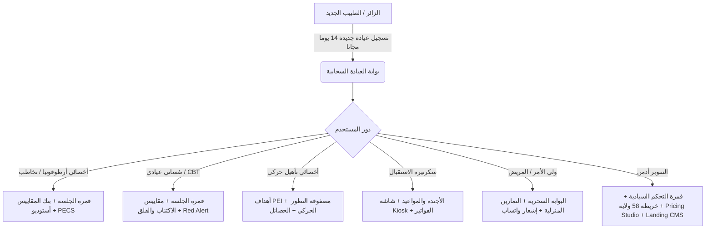
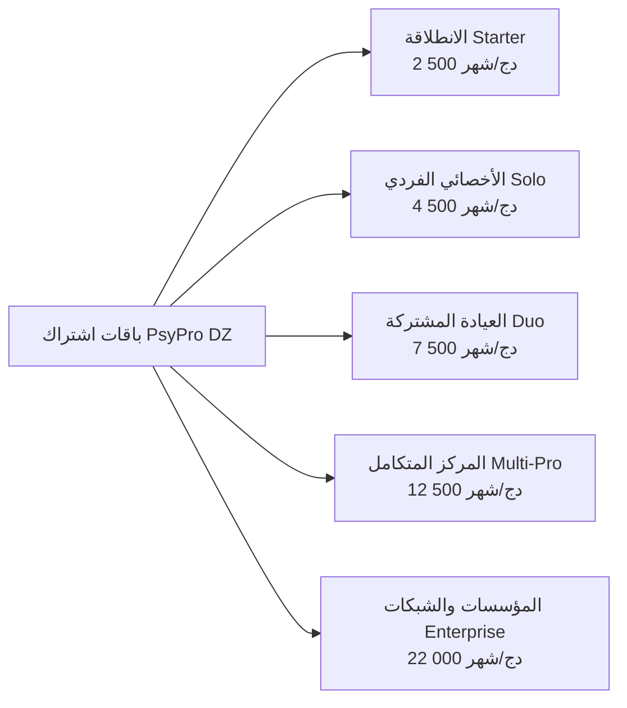

# 📋 وثيقة متطلبات المنتج الرسمية — PsyPro / ClinicSaaS
## (Product Requirements Document — PRD v2.4 Enterprise)

> **المنظومة السحابية الطبية السريرية المتقدمة لإدارة عيادات ومراكز الأرطوفونيا، الصحة النفسية، والتأهيل الحركي**  
> **تاريخ الإصدار**: سبتمبر 2026  
> **الإصدار المعماري**: v2.4 (Enterprise Monorepo — Production VPS)  
> **البيئة المعتمدة**: Web PWA + Laravel REST API Multi-Tenant  
> **النطاق الجغرافي المستهدف**: الجمهورية الجزائرية الديمقراطية الشعبية (58 ولاية) ودول شمال إفريقيا  

---

## فهرس المحتويات
1. [ملخص المنتج والرؤية الاستراتيجية (Executive Summary & Vision)](#1-ملخص-المنتج-والرؤية-الاستراتيجية)
2. [بيان المشكلة والفرصة السوقية (Problem Statement & Market Opportunity)](#2-بيان-المشكلة-والفرصة-السوقية)
3. [شخصيات المستخدمين ورحلات الاستخدام (User Personas & Journeys)](#3-شخصيات-المستخدمين-ورحلات-الاستخدام)
4. [المعمارية التقنية للمنظومة (System Architecture)](#4-المعمارية-التقنية-للمنظومة)
5. [المتطلبات الوظيفية التفصيلية (Functional Requirements — 12 Modules)](#5-المتطلبات-الوظيفية-التفصيلية)
   - FR-01: قمرة الجلسة السريرية المباشرة (Active Consultation Cockpit)
   - FR-02: محرك الروائز والمقاييس المقننة الـ 18 وتنبيهات الأمان Red Alert
   - FR-03: محرك الحصائل السريرية الشاملة وتصدير PDF (Master Bilan Engine)
   - FR-04: قمرة الأجندة والمواعيد وإشعارات WhatsApp Cloud الرسمية
   - FR-05: بورن الاستقبال الذاتي وتلفزيون قاعة الانتظار (Smart Kiosk & TV)
   - FR-06: بوابة الأولياء التفاعلية بالرابط السحري (Magic Link Parent Portal)
   - FR-07: أستوديو التخاطب الصوتي وبطاقات PECS وتصحيح النطق
   - FR-08: العيادة الافتراضية والسبورة الإكلينيكية التفاعلية (Teletherapy)
   - FR-09: المساعد السريري الذكي والتشخيص الفارق (Clinical AI Copilot & DDSS)
   - FR-10: الفوترة الطبية والخزينة ومطابقة الدفع الجزائري (BaridiMob & CCP)
   - FR-11: قمرة القيادة والسيطرة السيادية للسوبر أدمن (Sovereign Control Suite)
   - FR-12: أستوديو تخصيص وهوية الصفحة الرئيسية (Landing Page CMS & Studio)
6. [المتطلبات غير الوظيفية (Non-Functional Requirements — NFR)](#6-المتطلبات-غير-الوظيفية)
7. [نموذج التسعير والاشتراكات (Pricing Tiers & Monetization)](#7-نموذج-التسعير-والاشتراكات)
8. [مؤشرات الأداء ومقاييس النجاح (Success Metrics & KPIs)](#8-مؤشرات-الأداء-ومقاييس-النجاح)
9. [خارطة الطريق المستقبلية (Future Roadmap)](#9-خارطة-الطريق-المستقبلية)

---

## 1. ملخص المنتج والرؤية الاستراتيجية

### 1.1. هوية المنتج (Product Identity)
**PsyPro (ClinicSaaS)** هو أول نظام إكلينيكي سحابي متعدد المستأجرين (Multi-Tenant Clinical EHR & Practice Management Operating System) مُهندس خصيصاً ليناسب البيئة الطبية المغاربية والجزائرية.  
يجمع النظام في منصة متكاملة واحدة بين:
- إدارة الملف الطبي للمريض (EHR).
- قمرة الجلسة السريرية الموجهة بمسار الخطوات الـ 4 وتوثيق SOAP Notes.
- محرك رقمنة وتمرير الروائز السيكومترية واللغوية المقننة مع حساب فوري للدرجات التائية (T-Scores).
- أستوديو التخاطب الصوتي وبطاقات التواصل المصورة (PECS DZ).
- محطة تلفزيون قاعة الانتظار وبورن تسجيل الحضور الذاتي باللمس (Kiosk).
- بوابة أولياء ذكية بدون كلمات مرور تعمل عبر روابط واتساب السحرية.
- تكامل تام مع بوابات الدفع المحلية الجزائرية (BaridiMob, CCP, فواتير B2B).

### 1.2. الرؤية الاستراتيجية (Strategic Vision)
تمكين كل عيادة ومركز أرطوفونيا وصحة نفسية وتأهيل حركي في الجزائر من التحول الرقمي الشامل بنسبة 100%، واختصار 70% من وقت كتابة التقارير الإدارية والورقية ليتفرغ الممارس السريري لمرضاه، مع توفير مقاييس مقننة وموثوقة تدعم اتخاذ القرار الطبي السليم.

---

## 2. بيان المشكلة والفرصة السوقية

### 2.1. التحديات السريرية والتشغيلية في العيادات
| المشكلة السابقة في العيادة | الأثر السريري والمالي | الحل المبتكر في PsyPro |
| :--- | :--- | :--- |
| **الملفات الورقية وتشتت البيانات** | ضياع تاريخ الحالات وسوابق المرضى، صعوبة نقل الملف بين الأخصائي النفسي والأرطوفوني داخل نفس المركز. | ملف إلكتروني موحد (EHR) معزول لكل عيادة بتشفير AES-256 ومتاح للأخصائيين المصرح لهم. |
| **التصحيح اليدوي للمقاييس** | استغراق ساعة إلى ساعتين لحساب جداول الدرجات التائية ونقاط القطع لكل رائز (مثل CARS-2 أو Conners). | محرك تصحيح فوري يحسب الدرجات الخام والتائية ويولد رسوماً بيانية وخلاصة سريرية تلقائية بنقرة واحدة. |
| **إهدار وقت كتابة الحصائل (Bilan)** | قضاء الأخصائي لأمسياته في صياغة تقارير الحصيلة الأولية والمرحلية في ملفات Word غير موحدة. | مولد الحصائل الآلي (Master Bilan Builder) يدمج المقاييس وأهداف PEI ويصدر PDF رسمي بترويسة العيادة. |
| **غياب أولياء الأمور عن المتابعة المنزلية** | نسيان العائلات للتمارين المنزلية وتراجع نتائج التأهيل اللغوي والحركي بسبب انقطاع التدريب بين الجلسات. | بوابة سحرية برابط واتساب بدون كلمة مرور ترسل الواجبات المصورة والفيديوهات وتسمح للأولياء برفع تسجيلات أطفالهم. |
| **فوضى قاعة الانتظار وإحراج المواعيد** | تداخل أدوار المرضى، التردد على باب الطبيب لمقاطعته، وانعدام التنظيم الرقمي. | شاشة Kiosk تعمل باللمس عند المدخل مع تلفزيون يعرض الدور ورنين متناغم ينبه الطبيب في مكتبه فوراً. |
| **صعوبة الدفع الإلكتروني والاشتراكات** | عدم امتلاك معظم العيادات لبطاقات بنكية دولية (Visa/Mastercard) للدفع في البرمجيات الأجنبية. | دعم حصري لبريدي موب (BaridiMob QR/RIP) و CCP والتحويل البنكي الجزائري مع فواتير تجارية رسمية. |

---

## 3. شخصيات المستخدمين ورحلات الاستخدام

### 3.1. تفاصيل شخصيات المستخدمين (Personas)
1. **د. أمينة — أخصائية أرطوفونيا وتخاطب (Speech & Language Pathologist)**:
   - **الاحتياج**: تمرير مقاييس النطق (ELO, Alouette, Dyslexia, CARS-2)، استخدام بطاقات نطق صوتية مصورة، توليد حصيلة أرطوفونية رسمية ومشاركتها مع أولياء الأمور.
   - **نقطة الألم**: الجداول الورقية وتكرار كتابة نفس التوصيات في كل تقرير.
2. **أ. كريم — أخصائي نفسي عيادي (Clinical Psychologist)**:
   - **الاحتياج**: توثيق جلسات العلاج المعرفي السلوكي (CBT)، قياس شدة الضيق SUDS، رصد بنود الخطورة والانتحار تلقائياً (Red Alerts في BDI-II و PHQ-9)، والمحافظة الصارمة على السر المهني.
   - **نقطة الألم**: الخوف من اختراق خصوصية الملاحظات السريرية أو ضياع المتابعة بين الجلسات.
3. **د. فريال — أخصائية تأهيل نفسي-حركي (Psychomotor Therapist)**:
   - **الاحتياج**: تتبع التوازن، التناسق الحركي الدقيق والإجمالي، ومطابقة تطور المريض مع أهداف الخطة العلاجية الفردية (PEI).
4. **السيد مصطفى — ولي أمر طفل طيف توحد (Parent Persona)**:
   - **الاحتياج**: معرفة ما يجب تدريب الطفل عليه في المنزل، رؤية تطور النطق بالرسوم البيانية، دون تعقيدات تسجيل الدخول وتذكر كلمات المرور.
5. **مروى — موظفة الاستقبال والسكرتارية (Receptionist)**:
   - **الاحتياج**: تثبيت المواعيد بسرعة، كشف التعارض بين قاعات الفحص، ومتابعة من وصل إلى قاعة الانتظار.
6. **السوبر أدمن — إدارة النظام والسيادة (SuperAdmin)**:
   - **الاحتياج**: مراقبة صحة الخادم وخدمات PM2، التحكم في الباقات وتفعيل ميزاتها، خريطة الانتشار الوطني، وتحرير محتوى ومظهر الموقع مباشرة.

---

## 4. المعمارية التقنية للمنظومة

### 4.1. التكدس البرمجي المعتمد (Technology Stack)
- **الواجهة الأمامية (Frontend)**: React 18، Vite PWA، Tailwind CSS (Medical Zen Theme)، Lucide Icons، HTML5 Canvas للرسم السريري، WebRTC للتطبيب عن بعد.
- **الواجهة الخلفية (Backend)**: Laravel 11 REST API، PHP 8.3، Eloquent ORM، Sanctum Authentication، Spatie Multi-Tenancy Architecture.
- **قواعد البيانات والتخزين**: MySQL / PostgreSQL مع عزل المستأجرين (Tenant Isolation)، Redis للتحكم في الكاش وقوائم الانتظار.
- **إدارة العمليات والإنتاج (VPS Production)**:
  - Process 0: `clinic-backend` (Laravel API Server)
  - Process 1: `clinic-frontend` (Vite SPA/PWA Host)
  - Process 2: `clinic-queue` (Background Asynchronous Workers)
  - خادم سحابي عالي التوافر: IP `145.223.116.54` مع تشفير SSL/TLS كامل ونطاق رسمي `psypro.tech`.

---

## 5. المتطلبات الوظيفية التفصيلية

### FR-01: قمرة الجلسة السريرية المباشرة (Active Consultation Cockpit)
* **المسار السريري الإلزامي من 4 خطوات (4-Step Guided Flow)**:
  1. **الخطوة 1: الاستقبال وخط الأساس (Accueil & Baseline)**:
     - اختيار التخصص (أرطوفونيا / نفساني / حركي).
     - استيراد أهداف وملخص الجلسة السابقة بنقرة واحدة (`One-click Import`).
     - تقييم الحالة المزاجية اللحظية ومقارنتها بالحالة الأولى (Baseline).
  2. **الخطوة 2: التدخلات والبروتوكولات (Interventions & Clinical Tools)**:
     - مقياس الضيق الذاتي اللحظي (SUDS Scale 0-100) قبل وبعد التمرين.
     - سجل الأفكار التلقائية والتشوهات المعرفية (CBT Thought Record).
     - مصفوفة مخارج الحروف الفونولوجية (Phonetic Matrix) مع حساب نسبة الدقة اللحظية (`%`).
     - ميترونوم الإيقاع اللفظي والتنفس المتناغم (Metronome).
     - مسودة الرصد السريع (Scratchpad) مع زر دمج فوري في الملاحظات الطبية.
  3. **الخطوة 3: التوثيق السريري الذكي (SOAP Notes & Ambient Scribe)**:
     - تفريغ صوتي ذكي يدعم الدارجة الجزائرية، العربية الفصحى، والفرنسية الطبية.
     - صياغة الملاحظات وفق معيار SOAP الطبي الدولي:
       - **S (Subjective)**: شكوى المريض وملاحظات الولي.
       - **O (Objective)**: السلوك المرصود ونتائج التمارين المقاسة.
       - **A (Assessment)**: التحليل الإكلينيكي وفرضيات التقدم.
       - **P (Plan)**: الخطة للجلسة القادمة والواجب المنزلي.
     - قائمة أهداف الخطة الفردية (PEI Goals) تتغير ديناميكياً بحسب التخصص.
  4. **الخطوة 4: الإنهاء والإحالات والفوترة (Closure, Referrals & Billing)**:
     - تسجيل الإحالات الطبية الخارجية (ORL, Neurologie, Pédopsychiatrie, EEG).
     - إرسال ملخص التمارين للولي عبر واتساب بنقرة واحدة.
     - تسجيل أتعاب الجلسة بالدينار الجزائري وطباعة الوصل.
- **الميقاتية السريرية الحية (Live Stopwatch)**:
  - عداد مستمر بالثواني والدقائق لا يتوقف ولا يتصفر تلقائياً أثناء التنقل بين المراحل الأربع.

---

### FR-02: محرك الروائز والمقاييس المقننة الـ 18 ورادار الأمان
* **قائمة المقاييس المعيارية المعتمدة رقمياً**:
  1. `CARS-2`: مقياس تقدير التوحد الطفولي (Childhood Autism Rating Scale).
  2. `M-CHAT-R/F`: الفحص المعدل للتوحد لدى الأطفال الصغار مع المقابلة التتبعية.
  3. `BDI-II`: رائز بيك للاكتئاب (Beck Depression Inventory).
  4. `PHQ-9`: استبيان صحة المريض للاكتئاب.
  5. `GAD-7`: مقياس اضطراب القلق العام.
  6. `HAM-A`: مقياس هاملتون لتقييم القلق.
  7. `HAM-D`: مقياس هاملتون لتقييم الاكتئاب.
  8. `PCL-5`: مقياس اضطراب ما بعد الصدمة (PTSD).
  9. `DASS-21`: مقياس الاكتئاب والقلق والضغط النفسي.
  10. `Y-BOCS`: مقياس ييل-براون للوسواس القهري (OCD).
  11. `SNAP-IV`: مقياس فرط الحركة وتشتت الانتباه للأطفال (ADHD).
  12. `ASRS`: مقياس فرط الحركة وتشتت الانتباه للبالغين.
  13. `SPIN`: مقياس الرهاب الاجتماعي (Social Phobia Inventory).
  14. `PDSS-SR`: مقياس شدة اضطراب الهلع.
  15. `ISI`: مؤشر شدة الأرق واضطرابات النوم.
  16. `AQ-10`: مقياس طيف التوحد المختصر للبالغين.
  17. `PSS-10`: مقياس الضغط النفسي المدرك.
  18. `RSES`: مقياس روزنبرغ لتقدير الذات (Rosenberg Self-Esteem).
* **آليات التمرير (Passation Modalities)**:
  - تمرير إكلينيكي من قمرة المعالج أثناء الجلسة مع إمكانية شرح البنود.
  - تمرير ذاتي خارجي عن بُعد عبر رابط مشفر يرسل للمفحوص أو الولي.
* **رادار الأمان السريري الفوري (Clinical Red Alert)**:
  - فحص أوتوماتيكي فوري لبنود إيذاء النفس أو الأفكار الانتحارية (مثل البند 9 في BDI-II و PHQ-9).
  - عند رصد أي درجة إيجابية، يتم وسم السجل فوراً بـ:  
    `🚨 [تنبيه أمان سريري عاجل - RED ALERT]`.

---

### FR-03: محرك الحصائل السريرية الشاملة وتصدير PDF (Master Bilan Engine)
- دمج نتائج المقاييس المتعددة، الملاحظات العيادية، ومصفوفة أهداف PEI في وثيقة حصيلة موحدة (Bilan Initial / Bilan d'Évolution).
- صياغة إكلينيكية آلية للخلاصة والتوصيات باللغة العربية أو الفرنسية.
- تصدير تقرير PDF رسمي بمواصفات وزارة الصحة مع ترويسة العيادة، الخاتم الرقمي، كود التحقق QR، والرسوم البيانية.

---

### FR-04: قمرة الأجندة والمواعيد وإشعارات WhatsApp Cloud
- **زوايا الرؤية الـ 4**:
  1. `جدول الحصص بالساعة (Daily Timeline)` من 08:00 إلى 18:00 مع زر فوري لبدء الجلسة.
  2. `شبكة الأسبوع (Weekly Grid)` لتوزيع الحصص الأسبوعية بنقرة واحدة.
  3. `التقويم الشهري (Monthly Calendar)` لمتابعة الكثافة الإجمالية وإحصاء الحصص.
  4. `قائمة المواعيد (List View)` للفلترة والبحث السريع.
- **كشف التعارضات التلقائي (Conflict Detection Engine)**: منع حجز موعدين لنفس المعالج أو القاعة في نفس الوقت.
- **الجدولة المتكررة (Weekly Recurrence)**: تكرار الحصة أسبوعياً تلقائياً طيلة مدة الخطة العلاجية.
- **إشعارات WhatsApp الرسمية**: إرسال تذكير الموعد التلقائي للولي مع زر تأكيد الحضور ورابط البوابة.

---

### FR-05: بورن الاستقبال وتلفزيون قاعة الانتظار (Smart Kiosk & TV)
- **بورن الشاشة اللمسية (Self Check-in Kiosk)**:
  - يكتب المريض أو الولي رقم هاتفه أو رمز PIN عند دخول العيادة لتأكيد حضوره.
- **تلفزيون قاعة الانتظار (Waiting Room TV Screen)**:
  - يعرض رقم الدور الحالي، اسم العيادة، إرشادات توعوية طبية، والوقت المتوقع.
- **جرس التنبيه المتزامن (Doctor Chime Notification)**:
  - نغمة تنبيه صوتية لطيفة تنطلق في مكتب الطبيب فور تسجيل حضور المريض في قاعة الانتظار مع وميض ملف المريض.

---

### FR-06: بوابة الأولياء التفاعلية بالرابط السحري (Magic Link Portal)
- دخول فوري بدون كلمة مرور (Passwordless) عبر رابط آمن أو رمز QR.
- استعراض تمارين النطق والتأهيل المنزلي مع إرشادات فيديو وصوت من الأخصائي.
- إمكانية قيام الولي برفع مقاطع فيديو أو تسجيلات صوتية لتدريب الطفل في المنزل.
- استبيان قبلي آلي (Pre-Intake Anamnesis) يملؤه الولي قبل أول موعد لتسريع التشخيص.

---

### FR-07: أستوديو التخاطب الصوتي وبطاقات PECS DZ
- بنك يضم أكثر من 500 بطاقة علاجية مصورة ناطقة بالدارجة الجزائرية والعربية الفصحى.
- تصنيف البطاقات حسب مجالات الحياة اليومية (أطعمة، أدوات، مشاعر، أفعال).
- مصفوفة تصحيح مخارج الحروف الفونولوجية (Articulatory Matrix) وتحديد مستويات الخطأ (حذف، إبدال، تشويه).
- توليد كراسات تمارين منزلية وبطاقات مصورة قابلة للطباعة بتنسيق PDF.

---

### FR-08: العيادة الافتراضية والسبورة السريرية (Teletherapy)
- غرف علاجية مرئية متوافقة مع معايير الأمان الطبي تعتمد على WebRTC المشفر.
- سبورة إكلينيكية تفاعلية متزامنة بين المعالج والطفل في الوقت الفعلي (Real-time Canvas).
- مشاركة بطاقات التخاطب، ألعاب المطابقة، وتمارين الذاكرة البصرية التفاعلية أثناء المكالمة.

---

### FR-09: المساعد السريري والتشخيص الفارق (Clinical AI Copilot & DDSS)
- نظام دعم القرار الطبي (DDSS) يقترح الفرضيات التشخيصية وفق معايير الدليل التشخيصي والإحصائي الخامس (DSM-5).
- تفريغ صوتي سريري بالدارجة الجزائرية والفرنسية الطبية وتحويله إلى صيغة SOAP Note.
- محلل البيانات التخاطبي (Conversational BI): إمكانية سؤال المنصة باللغة الطبيعية (مثال: "ما هو معدل تحسن حالات التأتأة هذا الشهر؟") لترد بمخططات بيانية فورية.

---

### FR-10: الفوترة الطبية والخزينة ومطابقة الدفع الجزائري
- حساب أتعاب الجلسات والحصائل وتوليد وصولات القبض للمرضى بالدينار الجزائري (DZD).
- سجل الخزينة اليومي والإيرادات والمصروفات الداخلية للعيادة.
- إصدار فواتير اشتراك تجارية B2B معتمدة ضريبياً بين المنصة والعيادة المشتركة.
- إدارة إثباتات الدفع عبر بريدي موب (BaridiMob) والحساب البريدي الجاري (CCP).

---

### FR-11: قمرة القيادة والسيطرة السيادية للسوبر أدمن (Sovereign Control Suite)
تتكون لوحة السوبر أدمن من 10 أبراج مراقبة متخصصة:
1. **قمرة السيطرة السيادية (`sovereign_tower`)**: تفعيل وضع الصيانة العام، حجر عيادة مشبوهة، والتحكم الفوري في الحصص.
2. **إدارة العيادات والاشتراكات (`clinics`)**: التحكم في الحسابات، الدخول كمسؤول عيادة (`Impersonate`)، وتعيين كلمات السر مع التوثيق الجنائي.
3. **خريطة انتشار العيادات الوطنية (`geo_map`)**: التوزيع الجغرافي للعيادات المعتمدة عبر 58 ولاية وإحصاء الكثافة الطبية.
4. **محرك الكوبونات والإحالات (`coupons`)**: إنشاء أكواد الخصم الترويجية وعمولات BaridiMob للأطباء الشركاء.
5. **دورة الاشتراكات ومطاردة التجديد (`lifecycle`)**: أتمتة رسائل التذكير بانتهاء الاشتراك، فترات السماح، ومطابقة إيصالات الدفع.
6. **قمع تهيئة العيادات والتحويل (`onboarding_funnel`)**: تتبع الخطوات الـ 6 لتهيئة العيادة من التسجيل إلى أول جلسة.
7. **صحة السيرفر والمراقبة الحية (`telemetry`)**: مراقبة استهلاك المعالج، الذاكرة، وقوائم PM2 مع زر إعادة التشغيل ومسح الكاش.
8. **أستوديو توجيه الذكاء وتتبع التكلفة (`ai_routing`)**: توزيع المهام بين مزودي AI ومراقبة تكلفة الـ Tokens.
9. **مركز البث والإعلانات العامة (`broadcasts`)**: إرسال إشعارات وشريط إعلاني يظهر فوراً في شاشات كافة العيادات.
10. **سجل التدقيق الجنائي والأمني (`audit_logs`)**: توثيق كل حركة حساسة في النظام وحظر عناوين IP المشبوهة.

---

### FR-12: أستوديو تخصيص وهوية الصفحة الرئيسية (Landing Page CMS & Studio)
- التحكم المباشر من لوحة السوبر أدمن في واجهة الموقع العامة (`LandingPageView.jsx`) بدون الحاجة لإعادة البناء:
  - **السمة اللونية (Theme Accent)**: التبديل الفوري بين 6 أنماط لونية طبية (Emerald, Teal, Indigo, Violet, Cyan, Amber).
  - **شريط الإعلانات العلوي (Announcement Bar)**: تفعيل/تعطيل وتعديل النص والروابط.
  - **واجهة البطل (Hero Section)**: تعديل العناوين، نصوص الأزرار، ونقاط الثقة.
  - **شريط الإحصائيات الوطنية**: تعديل المؤشرات الأربعة (العيادات، المرضى، الروائز، الولايات).
  - **مفاتيح إظهار وإخفاء الأقسام (Section Toggles)**: إظهار أو إخفاء أي قسم في الصفحة بضغطة زر.
  - **محرر الأسئلة الشائعة (FAQ Manager)**: إضافة وتعديل وحذف أسئلة الصفحة الرئيسية.
  - **محرر آراء وشهادات الأخصائيين (Testimonials Manager)**: إدارة التقييمات والولايات ونصوص التزكية.
  - **تذييل الصفحة ومعلومات الاتصال (Footer Settings)**: أرقام الهواتف وواتساب والبريد والروابط الاجتماعية.
  - **استعادة الضبط الافتراضي (Reset to Defaults)**: زر استرجاع فوري لإعدادات المصنع الطبية.

---

## 6. المتطلبات غير الوظيفية (Non-Functional Requirements)

### 6.1. الأمان والسرية الطبية (Medical-Grade Security)
- تشفير البيانات الساكنة والمنقولة بمعيار `AES-256` و `TLS 1.3`.
- عزل كامل لقواعد بيانات ومعلومات كل عيادة (`Multi-Tenant Data Isolation`).
- الامتثال لقانون السر المهني الطبي وأخلاقيات معالجة البيانات الصحية.
- تسجيل جنائي كامل للعمليات الحساسة في جدول `audit_logs` مع تسجيل هوية الفاعل وعنوان IP.

### 6.2. الأداء والاستجابة (Performance & Reliability)
- زمن تحميل الصفحة الأولى (LCP) أقل من 1.2 ثانية.
- تشغيل الواجهة بتقنية الويب التقدمي (PWA) لدعم التثبيت المباشر على سطح المكتب وأجهزة الآيباد والتابلت.
- معالجة طلبات الـ API بزمن استجابة أقل من 150ms في المتوسط.
- استقرار خادم الإنتاج السحابي بنسبة توفر لا تقل عن `99.98%`.

### 6.3. تجربة المستخدم ودعم اللغة العربية (RTL & Zen UX)
- واجهة تدعم اللغة العربية من اليمين إلى اليسار (RTL First) مع دعم المصطلحات الطبية المتخصصة.
- لوحة ألوان طبية هادئة مضادة لإجهاد العين (Medical Zen Dark Palette).
- التزام صارم بقواعد نزاهة JSX البرمجية لمنع أي أخطاء في الـ Rendering.

---

## 7. نموذج التسعير والاشتراكات

### 7.1. مصفوفة باقات الاشتراك بالدينار الجزائري (DZD)
| اسم الباقة | الفئة المستهدفة | السعر الشهري | السعر السنوي (خصم شهرين) | سعة الأخصائيين | سعة المرضى | حصة تقارير الذكاء |
| :--- | :--- | :---: | :---: | :---: | :---: | :---: |
| **الانطلاقة (Starter)** | حديث التخرج والعيادة الناشئة | 2,500 دج | 25,000 دج | أخصائي 1 | 60 مريض | غير مشمول |
| **الأخصائي الفردي (Solo)** | عيادة مستقلة ذات ممارسة نشطة | 4,500 دج | 42,000 دج | أخصائي 1 | 250 مريض | 50 تقرير/شهر |
| **العيادة المشتركة (Duo)** | مقر مشترك (أرطوفونيا + نفساني) | 7,500 دج | 72,000 دج | 2 أخصائيين | 1,000 مريض | 100 تقرير/شهر |
| **المركز المتكامل (Multi-Pro)** | مراكز التأهيل متعددة التخصصات | 12,500 دج | 120,000 دج | حتى 8 أخصائيين | 1,500 مريض | 250 تقرير/شهر |
| **المؤسسات والشبكات (Enterprise)** | المجمعات الكبرى وجمعيات التوحد | 22,000 دج | 210,000 دج | حتى 20 أخصائي | 10,000 مريض | 500 تقرير/شهر |

* **فترة تجريبية مجانية**: 14 يوماً بكافة المميزات السريرية بدون اشتراط بطاقة بنكية.
* **طرق السداد المحلية**: بريدي موب BaridiMob (QR Code & RIP)، الحساب البريدي الجاري CCP، والتحويل البنكي المباشر مع فاتورة تجارية رسمية.

---

## 8. مؤشرات الأداء ومقاييس النجاح (KPIs)

### 8.1. مؤشرات الأثر السريري والتشغيلي
- **اختصار وقت كتابة التقارير**: تقليل وقت إعداد الحصائل السريرية بنسبة لا تقل عن `70%`.
- **تقليل غياب المواعيد**: خفض نسبة الغياب غير المبرر بنسبة `45%` بفضل تذكيرات واتساب وبورن Kiosk.
- **التزام الأولياء بالتمارين**: تحقيق نسبة تفاعل تتجاوز `85%` في إنجاز الواجبات عبر البوابة السحرية.

### 8.2. مؤشرات النمو التجاري للمنصة (SaaS Metrics)
- **نسبة تحويل الفترات التجريبية (Trial-to-Paid Conversion)**: مستهدف > `35%`.
- **معدل الاحتفاظ بالاشتراكات (Net Retention Rate)**: مستهدف > `92%`.
- **الإيراد الشهري المتكرر (MRR Growth)**: نمو شهري مركب بمعدل `15%`.
- **التغطية الجغرافية الوطنية**: تسجيل عيادات معتمدة في كافة الولايات الـ 58.

---

## 9. خارطة الطريق المستقبلية (Future Roadmap)

### المرحلة الأولى: الربع الأخير 2026 (Q4 2026)
- [x] إطلاق مصفوفة المقارنة المباشرة الحية للميزات الـ 40 في الصفحة الرئيسية.
- [x] إطلاق أستوديو التحكم والتخصيص الكامل في مظهر وهوية الصفحة الرئيسية (Landing CMS).
- [ ] إطلاق تطبيق مرافق مخصص للأولياء في متجر Google Play و App Store.

### المرحلة الثانية: النصف الأول 2027 (H1 2027)
- [ ] التكامل التقني مع منظومة بطاقة الشفاء والتأمين الصحي الوطني (CNAS / CASNOS).
- [ ] تدريب نموذج ذكاء اصطناعي محلي خاص بالفحص الفونولوجي واللهجات الجزائرية الدقيقة.
- [ ] فتح فرع التوسع الإقليمي لمنطقة المغرب العربي (تونس والمغرب).

---

> **اعتماد الوثيقة**:  
> تم تحرير واعتماد هذه الوثيقة كمرجع هندسي وسريري ملزم لفرق التطوير وإدارة المنتج في منصة **PsyPro / ClinicSaaS**.  
> آخر تحديث: **13 سبتمبر 2026**.
