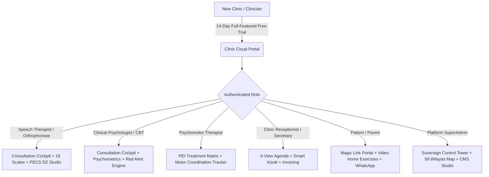
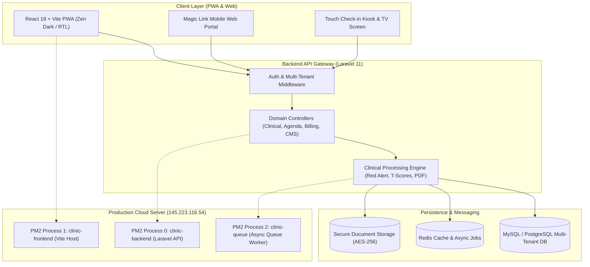
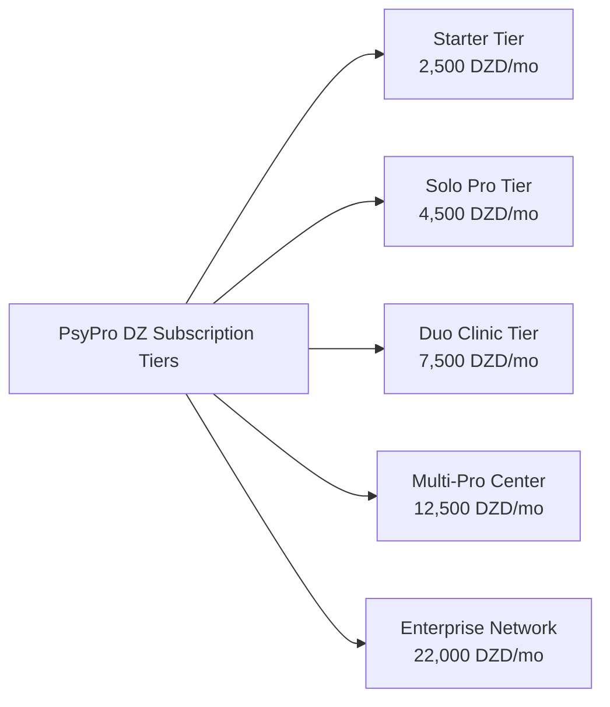

# 📋 Official Product Requirements Document (PRD) — PsyPro / ClinicSaaS
## Enterprise Edition (v2.4 Production Standard)

> **The Sovereign Multi-Tenant Clinical Operating System & EHR for Speech-Language Therapy, Clinical Psychology, and Psychomotor Rehabilitation**  
> **Release Date:** September 2026  
> **Architecture Version:** v2.4 (Enterprise Monorepo — Production VPS)  
> **Target Deployment:** High-Availability Web PWA + Laravel REST API Multi-Tenant  
> **Geographic Focus:** People's Democratic Republic of Algeria (58 Wilayas) & MENA Region  

---

## Table of Contents
1. [Executive Summary & Strategic Vision](#1-executive-summary--strategic-vision)
2. [Problem Statement & Market Opportunity](#2-problem-statement--market-opportunity)
3. [User Personas & Clinical Workflow](#3-user-personas--clinical-workflow)
4. [System Architecture & Technology Stack](#4-system-architecture--technology-stack)
5. [Detailed Functional Requirements (12 Modules)](#5-detailed-functional-requirements-12-modules)
   - [FR-01: Active Consultation Cockpit](#fr-01-active-consultation-cockpit)
   - [FR-02: 18 Standardized Psychometric Scales & Red Alert Radar](#fr-02-18-standardized-psychometric-scales--red-alert-radar)
   - [FR-03: Master Bilan Engine & Official PDF Export](#fr-03-master-bilan-engine--official-pdf-export)
   - [FR-04: Clinical Agenda & Official WhatsApp Cloud Engine](#fr-04-clinical-agenda--official-whatsapp-cloud-engine)
   - [FR-05: Smart Kiosk & Waiting Room TV Screen](#fr-05-smart-kiosk--waiting-room-tv-screen)
   - [FR-06: Magic Link Parent/Patient Portal](#fr-06-magic-link-parentpatient-portal)
   - [FR-07: PECS DZ Speech Studio & Articulatory Matrix](#fr-07-pecs-dz-speech-studio--articulatory-matrix)
   - [FR-08: Teletherapy & Real-time Clinical Canvas](#fr-08-teletherapy--real-time-clinical-canvas)
   - [FR-09: Clinical AI Copilot & DDSS](#fr-09-clinical-ai-copilot--ddss)
   - [FR-10: Medical Billing, Treasury & Algerian Payment Gateway](#fr-10-medical-billing-treasury--algerian-payment-gateway)
   - [FR-11: SuperAdmin Sovereign Control Suite](#fr-11-superadmin-sovereign-control-suite)
   - [FR-12: Landing Page CMS & Appearance Studio](#fr-12-landing-page-cms--appearance-studio)
6. [Non-Functional Requirements (NFR)](#6-non-functional-requirements-nfr)
7. [Monetization, Packaging & Algerian DZD Pricing Tiers](#7-monetization-packaging--algerian-dzd-pricing-tiers)
8. [Success Metrics & Key Performance Indicators (KPIs)](#8-success-metrics--key-performance-indicators-kpis)
9. [Future Product Roadmap](#9-future-product-roadmap)

---

## 1. Executive Summary & Strategic Vision

### 1.1. Product Identity
**PsyPro (ClinicSaaS)** is the premier, medical-grade, multi-tenant clinical Electronic Health Record (EHR) and practice management operating system tailored specifically for Algerian and North African allied health practitioners.

The platform unifies six essential clinical pillars into a single frictionless operating system:
1. **Clinical Electronic Health Record (EHR)** with rigorous patient confidentiality and isolated tenant schemas.
2. **Active Consultation Cockpit** structured on an immutable 4-step clinical flow with integrated SOAP notes and dynamic individual treatment goals (PEI).
3. **18 Standardized Digital Psychometric & Speech Assessments** featuring instant normative T-score calculation and automated red alert safety flags.
4. **Interactive Speech Therapy Studio (PECS DZ)** with 500+ localized voice cards (Algerian Darja and Modern Standard Arabic) and articulatory phonological matrices.
5. **Physical Practice Automation**: Self-check-in tactile kiosk, waiting room TV queue display, and synchronized acoustic doctor chime notifications.
6. **Frictionless Parent Engagement**: Magic-link patient portal without passwords, integrated with WhatsApp Cloud for appointments and home therapy assignments.

### 1.2. Strategic Mission
To empower every independent therapist, specialized clinic, and multi-disciplinary rehabilitation center across Algeria’s 58 Wilayas to achieve 100% digital transformation, eliminating over 70% of bureaucratic paperwork and administrative overhead, allowing practitioners to focus on clinical excellence and patient care.

---

## 2. Problem Statement & Market Opportunity

### 2.1. Traditional Practice Inefficiencies vs. PsyPro Solutions

| Clinical & Operational Challenge | Practical Impact on Clinicians | PsyPro Enterprise Solution |
| :--- | :--- | :--- |
| **Scattered Paper Files & Lost Medical Histories** | Loss of longitudinal patient history, inability to cross-collaborate between psychologists and speech therapists. | Unified, encrypted digital EHR with role-based access control and instant file transfer within multi-practitioner clinics. |
| **Manual Scoring of Standardized Scales** | Taking 60 to 120 minutes per patient to manually score tables and calculate cut-offs for CARS-2, Conners, or BDI-II. | Instant algorithmic scoring engine calculating raw scores, percentiles, and T-scores with auto-generated charts in <1 second. |
| **Exhausting Clinical Bilan Drafting** | Clinicians spending evenings copying and pasting diagnostic reports into unstructured Word documents. | **Master Bilan Engine**: Combines assessment data, PEI goals, and clinical observations into stamped, official PDF reports. |
| **Lack of Home Therapy Compliance** | Families forgetting articulatory exercises between weekly visits, delaying rehabilitation progress by up to 50%. | **Magic Link Portal**: Passwordless WhatsApp access delivering audio/video home exercises and allowing parents to upload recordings. |
| **Waiting Room Chaos & Room Interruptions** | Patients knocking on therapy doors, uncoordinated arrivals, and privacy breaches in waiting areas. | **Touch Kiosk & Waiting TV**: Self check-in with PIN, live status board, and gentle in-office chime alerting the doctor instantly. |
| **International Payment Barriers for SaaS** | Local clinics lack Visa/Mastercard credit cards, barring them from using foreign medical software. | Native integration with Algerian payment methods: **BaridiMob QR/RIP, CCP wire transfers, and official commercial invoices**. |

---

## 3. User Personas & Clinical Workflow

### 3.1. Detailed Persona Profiles

1. **Dr. Amina — Speech & Language Pathologist (Orthophoniste)**
   - **Clinical Need:** Standardized speech assessments (articulation, phonology, language acquisition), accessible visual/vocal stimuli, and standardized initial/progress bilans for schools and insurance.
   - **Pain Point:** Spending excessive hours manually scoring diagnostic protocols and typing repetitive reports.

2. **Prof. Karim — Clinical Psychologist & CBT Practitioner**
   - **Clinical Need:** Cognitive Behavioral Therapy (CBT) documentation, Subjective Units of Distress (SUDS) tracking, automated suicide/self-harm risk detection (PHQ-9 / BDI-II Item 9), and strict medical confidentiality.
   - **Pain Point:** Risk of confidential therapy notes being compromised or lost across unencrypted devices.

3. **Dr. Feryal — Psychomotor Rehabilitation Specialist**
   - **Clinical Need:** Tracking fine and gross motor milestones, balance metrics, and measuring patient progress against customized Individual Education/Treatment Plans (PEI).
   - **Pain Point:** Difficulty visualizing longitudinal progress curves across multiple months of physical therapy.

4. **Mr. Mostefa — Parent of an Autistic Child**
   - **Personal Need:** Clear guidance on how to practice speech and behavioral routines at home, transparent progress tracking, without the burden of remembering passwords or complex logins.
   - **Pain Point:** Frustration from not knowing whether their child is improving or how to replicate clinic exercises at home.

5. **Marwa — Clinic Receptionist & Front-Desk Coordinator**
   - **Operational Need:** Rapid appointment scheduling, conflict prevention across multi-room clinics, and real-time oversight of patient arrivals.
   - **Pain Point:** Frequent patient disputes over waiting priority and constant interruptions to therapy rooms.

6. **System SuperAdmin — Platform Executive & Sovereign Operator**
   - **Strategic Need:** Real-time visibility into server telemetry (PM2, CPU, Memory), instant clinic provisioning, automated payment chases, national geo-analytics, and live landing page CMS customization.

---

## 4. System Architecture & Technology Stack

### 4.1. Technical Stack Details
- **Frontend:** React 18, Vite PWA, Vanilla Tailwind CSS (Medical Zen Dark Palette, Emerald/Teal accents, glassmorphic backdrop-blur cards), Lucide Icons, HTML5 Canvas, WebRTC.
- **Backend:** Laravel 11 REST API, PHP 8.3, Eloquent ORM with strict Multi-Tenant isolation (`tenant_id`), Laravel Sanctum token security.
- **Database & Storage:** MySQL 8.0+ / PostgreSQL, Redis Queue Workers, ArPHP & DomPDF for RTL Arabic/French medical rendering.
- **Hosting Environment:** Ubuntu Linux VPS (`145.223.116.54`), fully encrypted with SSL/TLS under official domain `https://psypro.tech`. Process managed by PM2 cluster (3 persistent daemons).

---

## 5. Detailed Functional Requirements (12 Modules)

### FR-01: Active Consultation Cockpit
* **The 4-Step Guided Clinical Flow:**
  1. **Step 1: Reception & Baseline (Accueil & Baseline):**
     - Dynamic specialty selection: Speech Therapy (`orthophonie`), Clinical Psychology (`psychologie`), Psychomotor (`psychomotricite`).
     - **One-Click Historical Import**: Imports previous session targets, clinical homework, and current mood baseline.
     - Mood and emotional state rating against initial intake benchmarks.
  2. **Step 2: Interventions & Protocols (Interventions & Outillage):**
     - **SUDS Tracker (0–100)**: Real-time distress meter before and after interventions.
     - **CBT Thought Record**: Automatic thought identification, cognitive distortion taxonomy, and rational alternatives.
     - **Phonetic & Articulation Matrix**: Sound and phoneme drill grid with instantaneous accuracy percentage calculation (`%`).
     - **Speech Metronome**: Adjustable audio-visual metronome for stuttering rhythm control and rhythmic breathing drills.
     - **Clinical Scratchpad**: Free-form buffer with an instantaneous "Merge to SOAP" button.
  3. **Step 3: Intelligent Clinical Documentation (SOAP Notes & Ambient Scribe):**
     - Ambient voice recognition supporting Algerian Darja, Modern Standard Arabic, and clinical French.
     - Automated alignment into international SOAP structure:
       - **S (Subjective):** Patient narrative, chief complaint, parent updates.
       - **O (Objective):** Quantified exercise outcomes, behavioral observations, score tallies.
       - **A (Assessment):** Clinical interpretation, progress velocity, and diagnostic hypotheses.
       - **P (Plan):** Next session focus, prescribed home therapy, and referral directives.
     - Individual Treatment Plan (PEI) goals update dynamically based on practitioner specialty.
  4. **Step 4: Closure, Referrals & Billing (Clôture & Facturation):**
     - Multi-specialty medical referral creation (ORL, Neurologist, Child Psychiatrist, EEG).
     - One-click WhatsApp homework summary dispatch to parent.
     - Fee recording in Algerian Dinars (DZD) with instant receipt generation.
* **Persistent Live Clinical Stopwatch:**
  - Running elapsed-time counter that remains active across all 4 stages without resetting on tab changes.

---

### FR-02: 18 Standardized Psychometric Scales & Red Alert Radar
* **Complete Standardized Clinical Inventory:**
  1. `CARS-2`: Childhood Autism Rating Scale.
  2. `M-CHAT-R/F`: Modified Checklist for Autism in Toddlers with Follow-Up.
  3. `BDI-II`: Beck Depression Inventory (Second Edition).
  4. `PHQ-9`: Patient Health Questionnaire for Depression.
  5. `GAD-7`: Generalized Anxiety Disorder Scale.
  6. `HAM-A`: Hamilton Anxiety Rating Scale.
  7. `HAM-D`: Hamilton Depression Rating Scale.
  8. `PCL-5`: Post-Traumatic Stress Disorder Checklist for DSM-5.
  9. `DASS-21`: Depression, Anxiety, and Stress Scales (Short Form).
  10. `Y-BOCS`: Yale-Brown Obsessive-Compulsive Scale.
  11. `SNAP-IV`: Swanson, Nolan, and Pelham Rating Scale for ADHD (Teacher & Parent).
  12. `ASRS`: Adult ADHD Self-Report Scale.
  13. `SPIN`: Social Phobia Inventory.
  14. `PDSS-SR`: Panic Disorder Severity Scale (Self-Report).
  15. `ISI`: Insomnia Severity Index.
  16. `AQ-10`: Autism Spectrum Quotient (10-Item Screening).
  17. `PSS-10`: Perceived Stress Scale.
  18. `RSES`: Rosenberg Self-Esteem Scale.
* **Administration Protocols:**
  - **In-Session Direct Passing**: Interactive questionnaire administered by therapist during session with item-by-item guidance.
  - **Remote Self-Assessment**: Secure one-time link sent to patient or parent via SMS/WhatsApp with encrypted remote submission.
* **Clinical Red Alert Engine:**
  - Instant algorithmic interception of suicidal ideation and self-harm items (e.g., Item 9 on BDI-II and PHQ-9).
  - Positive score immediately locks safety banner:  
    `🚨 [CRITICAL CLINICAL SAFETY ALERT — IMMEDIATE RED ALERT]`, triggering notification to the attending clinician.

---

### FR-03: Master Bilan Engine & Official PDF Export
- Integrates multi-scale psychometric data, clinical observations, and PEI objective progress into an authoritative clinical bilan (`Bilan Initial` / `Bilan d'Évolution`).
- Automated bilingual clinical narrative generator (Arabic & French) synthesizing score curves into readable medical prose.
- High-fidelity PDF output compliant with Algerian Ministry of Health standards: official clinic letterhead, digital stamp/signature, QR code authenticity seal, and normative bar charts.

---

### FR-04: Clinical Agenda & Official WhatsApp Cloud Engine
- **4 Operational Views:**
  1. `Hourly Timeline (Daily)`: 08:00 to 18:00 chronological slot display with immediate "Launch Active Cockpit" trigger.
  2. `Weekly Grid`: Cross-room and cross-therapist weekly distribution.
  3. `Monthly Calendar`: High-level load monitoring and session density heatmaps.
  4. `Searchable List`: Multi-filter tabular view by status, therapist, or patient.
- **Automated Conflict Detection Engine:** Strictly prohibits double bookings for the same practitioner or physical therapy room.
- **Weekly Recurrence Scheduler:** Automatically projects recurrent weekly therapy appointments across customizable treatment durations (12–36 weeks).
- **Native WhatsApp Reminders:** Automated reminder dispatch 24h before appointment with instant "Confirm Attendance" and "Reschedule" links.

---

### FR-05: Smart Kiosk & Waiting Room TV Screen
- **Self Check-in Kiosk:**
  - Touchscreen interface located at clinic entrance allowing patients/parents to confirm arrival using phone number or 4-digit PIN.
- **Waiting Room TV Display:**
  - Displays currently called patient token, practitioner room assignment, clinic educational health tips, and estimated wait times.
- **Acoustic Doctor Chime:**
  - Low-latency sound notification and visual glow triggered in the doctor’s office the moment a patient checks in at the reception kiosk.

---

### FR-06: Magic Link Parent/Patient Portal
- **Zero-Password Authentication:** Instant biometric/magic link access via secure WhatsApp token, eliminating forgotten password lockouts.
- **Interactive Home Rehabilitation Plan:** Visual cards detailing speech exercises, audio articulation models, and motor exercises.
- **Patient Progress Media Upload:** Parents can upload video and audio recordings of the child practicing exercises at home directly to the clinic file.
- **Pre-Intake Anamnesis Survey:** Digital developmental history questionnaire completed by parents before the initial appointment.

---

### FR-07: PECS DZ Speech Studio & Articulatory Matrix
- Over 500 validated visual communication cards with audio pronunciations in both Algerian Darja and Modern Standard Arabic.
- Real-life categorized taxonomy (Foods, School Supplies, Emotional States, Daily Actions, Needs).
- **Articulatory Phonological Matrix**: Real-time phonetic phoneme analysis mapping errors across 3 clinical typologies (Omission, Substitution, Distortion).
- Direct generation of customized printable home drill sheets in PDF format.

---

### FR-08: Teletherapy & Real-time Clinical Canvas
- Peer-to-peer encrypted WebRTC teleconsultation meeting medical privacy standards.
- Synchronized interactive clinical canvas: simultaneous real-time drawing and visual stimulus manipulation between clinician and child.
- Digital PECS card manipulation, visual matching games, and auditory training drills playable inside the teletherapy window.

---

### FR-09: Clinical AI Copilot & DDSS
- **Diagnostic Decision Support System (DDSS):** Cross-references assessment anomalies with DSM-5 criteria to formulate differential diagnostic possibilities.
- **Ambient Voice Medical Scribe:** Converts doctor-patient clinical dialogue spoken in Algerian Darja, French, and Arabic into structured SOAP format.
- **Conversational BI (Natural Language Analytics):** Clinicians can query clinic data via natural language (e.g., *"Show the average stuttering severity reduction over the last 3 months"*) and receive instant visual charts.

---

### FR-10: Medical Billing, Treasury & Algerian Payment Gateway
- Complete Algerian Dinar (DZD) fee processing for consultations, comprehensive bilans, and teletherapy sessions.
- In-clinic daily cash register tracking cash on hand, bank deposits, and internal clinic operational expenses.
- B2B tax-compliant commercial SaaS invoices generated between the platform and subscribing clinics.
- Verification and reconciliation system for **BaridiMob** (instant QR code and RIP matching) and **Algerie Poste CCP** transaction slips.

---

### FR-11: SuperAdmin Sovereign Control Suite
The SuperAdmin operations center comprises 10 dedicated control towers:
1. **Sovereign Tower (`sovereign_tower`)**: System-wide emergency maintenance toggle, malicious tenant quarantine, and real-time quota overrides.
2. **Clinic Management & Forensic Impersonation (`clinics`)**: Clinic provisioning, credential reset, and forensic "Log-in As Clinic" audit tracking.
3. **58 Wilayas National Geo Map (`geo_map`)**: Geographic visualization of active clinics and regional medical density across Algeria.
4. **Promo & Affiliate Engine (`coupons`)**: Discount codes, medical partner referral tracking, and automated BaridiMob commission payouts.
5. **Subscription Lifecycle & Chaser (`lifecycle`)**: Automated WhatsApp/email payment chasing, grace period management, and payment slip review.
6. **Onboarding Funnel (`onboarding_funnel`)**: Step-by-step progress tracking for newly registered clinics across the 6 onboarding milestones.
7. **Server Telemetry & PM2 Operations (`telemetry`)**: CPU, RAM, and disk utilization graphs, error log inspect, and one-click PM2 restart/cache clear.
8. **AI Routing Studio (`ai_routing`)**: Token consumption monitoring, provider latency fallbacks, and operational budget caps.
9. **Emergency Broadcast Center (`broadcasts`)**: Global notification banner publishing across all connected clinic dashboards.
10. **Forensic Audit Logger (`audit_logs`)**: Tamper-proof recording of administrative actions and automated IP threat banning.

---

### FR-12: Landing Page CMS & Appearance Studio
Enables direct control over the public landing page (`https://psypro.tech/`) from the SuperAdmin panel without rebuilding code:
- **Medical Theme Accent Switcher:** Live switching across 6 clinical color themes (Emerald, Teal, Indigo, Violet, Cyan, Amber).
- **Global Announcement Bar:** Instant toggle and editing for promotional notices and links.
- **Hero & Value Proposition Editor:** Real-time updates to headlines, subtext, and call-to-action buttons.
- **National Metric Counters:** Live editing for the 4 platform proof metrics (Clinics, Patients, Assessments, Wilayas).
- **Granular Section Visibility Toggles:** Toggle individual sections on/off (Hero, Stats, Comparison, Modules, Pricing, Testimonials, FAQ, Footer).
- **FAQ & Testimonials Manager:** Add, edit, reorder, or delete practitioner testimonials and frequently asked questions.
- **Factory Reset Functionality:** One-click rollback to default clinical branding.

---

## 6. Non-Functional Requirements (NFR)

### 6.1. Security & Medical Confidentiality
- Industry-grade encryption: `AES-256` for data at rest and `TLS 1.3` for all data in transit.
- Multi-tenant data segregation: Strict query-level tenant isolation preventing cross-clinic data leakage.
- Strict compliance with medical confidentiality standards, professional secrecy laws, and patient privacy ethics.
- Detailed audit logs capturing user IDs, timestamps, and IP addresses for every medical record access.

### 6.2. Performance & Reliability
- **Largest Contentful Paint (LCP):** < 1.2 seconds across standard 4G networks in Algeria.
- **API Latency:** 95th percentile REST API response time under 150ms.
- **Progressive Web App (PWA):** Offline service workers allowing clinicians to view today’s schedule and cached patient files during network dropouts.
- **System Availability SLA:** 99.98% guaranteed uptime on high-availability production VPS.

### 6.3. Usability & Dual-Language Ergonomics (RTL / LTR)
- Native Right-to-Left (RTL) Arabic interface with full Left-to-Right (LTR) French toggling.
- High-contrast Medical Zen Dark Theme engineered to prevent optical fatigue during consecutive clinical sessions.
- Strict JSX variable scoping adhering to zero-runtime-error architectural standards.

---

## 7. Monetization, Packaging & Algerian DZD Pricing Tiers

### 7.1. Commercial Tier Matrix (Algerian Dinars — DZD)

| Plan Tier | Target Audience | Monthly Price | Annual Price (2 Months Free) | Practitioner Limit | Active Patient Limit | AI Reports Quota |
| :--- | :--- | :---: | :---: | :---: | :---: | :---: |
| **Starter (الانطلاقة)** | Recent graduates & early-stage single clinics | 2,500 DZD | 25,000 DZD | 1 Practitioner | 60 Patients | Add-on |
| **Solo Pro (الأخصائي الفردي)** | Established private independent practice | 4,500 DZD | 42,000 DZD | 1 Practitioner | 250 Patients | 50 Reports/mo |
| **Duo Clinic (العيادة المشتركة)** | Dual-practice office (Speech Therapist + Psychologist) | 7,500 DZD | 72,000 DZD | 2 Practitioners | 1,000 Patients | 100 Reports/mo |
| **Multi-Pro (المركز المتكامل)** | Comprehensive rehabilitation centers | 12,500 DZD | 120,000 DZD | Up to 8 Practitioners | 1,500 Patients | 250 Reports/mo |
| **Enterprise (المؤسسات والشبكات)** | Major medical groups & autism associations | 22,000 DZD | 210,000 DZD | Up to 20 Practitioners | 10,000 Patients | 500 Reports/mo |

- **Unconditional Free Trial:** 14-day full-access trial with all clinical modules enabled, no payment card required.
- **Accepted Domestic Payment Gateways:** BaridiMob (instant QR scanning & RIP verification), CCP (La Poste Algérienne), and bank wire with stamped commercial B2B invoices.

---

## 8. Success Metrics & Key Performance Indicators (KPIs)

### 8.1. Clinical & Practice Efficacy KPIs
- **Documentation Time Reduction:** Decrease time required to produce a standardized diagnostic report by $\ge 70\%$.
- **No-Show Rate Reduction:** Decrease appointment absenteeism by $45\%$ via automated WhatsApp Cloud reminders and self-check-in kiosk.
- **Home Exercise Adherence:** Achieve $> 85\%$ completion rate of prescribed exercises through the zero-password Magic Link portal.

### 8.2. Platform Business & SaaS Growth KPIs
- **Trial-to-Paid Conversion Rate:** Target $\ge 35\%$ across all newly onboarded clinics.
- **Annual Net Retention Rate (NRR):** Target $\ge 92\%$.
- **Monthly Recurring Revenue (MRR) Growth:** Sustainable Month-over-Month growth target of $15\%$.
- **Geographic Coverage:** Verified clinical footprint across all 58 Algerian Wilayas by Q2 2027.

---

## 9. Future Product Roadmap

### Phase 1: Q4 2026 (Operational & Live)
- [x] Launch of the dynamic 40-feature comparison matrix on the public landing page.
- [x] Launch of the SuperAdmin Landing Page CMS Studio for no-code styling and text management.
- [ ] Native mobile companion applications for parents (iOS & Android).

### Phase 2: H1 2027 (National Integrations)
- [ ] Direct technical integration with CNAS / CASNOS national health insurance and Chifa electronic card standards.
- [ ] Proprietary localized Speech AI model trained specifically on Algerian dialects (Darja, Tamazight, Chaoui) and clinical speech phonology.
- [ ] Regional expansion pilot into neighboring North African markets (Tunisia & Morocco).

---

> **Document Approval & Governance:**  
> This document serves as the binding functional and architectural specification for the engineering, clinical, and executive teams of **PsyPro / ClinicSaaS**.  
> Last Revision: **September 2026**.
